# Label Hold

> A lot-release gate for a 12-person co-packer. Three independent documents decide
> if a lot ships: the product spec, the supplier Certificate of Analysis, and a
> photo of the printed label. An ADK composite agent ingests all three in
> parallel, matches US major-9 allergens, computes a deterministic HOLD/RELEASE
> verdict, and writes the result to Firestore. Gemma produces an executive
> summary on every hold.

Built for the **All Things Agentic Hackathon** (Devpost / Google) on the
**Taskmaster** track. Deadline: 2026-08-31 5:00pm PDT.

| Live URL | Service |
|---|---|
| https://frontend-472857763269.asia-southeast1.run.app/ | React SPA (QA-facing) |
| https://dashboard-hnvjxkvfoq-as.a.run.app/ | Dashboard BFF + FastAPI + proof-of-action harness |
| https://adk-runtime-hnvjxkvfoq-as.a.run.app/ | ADK composite graph (`release_pipeline`) |
| https://leanview-consumer-hnvjxkvfoq-as.a.run.app/ | Pub/Sub push consumer + Firestore materializer (IAM-protected) |

---

## Table of contents

- [What it does](#what-it-does)
- [Architecture](#architecture)
  - [System topology](#system-topology)
  - [ADK composite graph](#adk-composite-graph)
  - [Lot data flow](#lot-data-flow)
  - [Multi-allergen set difference](#multi-allergen-set-difference)
- [Example input images](#example-input-images)
- [Live demo](#live-demo)
- [Running locally](#running-locally)
- [Cloud Run deployment](#cloud-run-deployment)
- [Repository layout](#repository-layout)
- [Allergen vocabulary](#allergen-vocabulary)
- [Design decisions](#design-decisions)
- [Operational notes](#operational-notes)

---

## What it does

A QA lead drops three files (spec, CoA, label photo) into a single dashboard
upload zone. The composite agent extracts allergens from each document, computes
the deterministic set difference
`(spec.allergens ∪ coa.allergens) − label.allergens`, and decides:

- **RELEASED** — the label declares everything the spec/CoA contain. Clean lot.
- **HELD** — at least one allergen from spec or CoA is missing from the label.
  The lot names the exact undeclared allergen(s) and publishes a `lot.held`
  event so downstream systems (label redesign, supplier call, recall workflow)
  can react.
- **HELD (incomplete_packet)** — one or more documents are empty or unreadable.
  Fail-closed: missing data never auto-releases.

When the verdict is HELD, a second LLM call (Gemma 4 31B) writes a one-paragraph
executive summary that gets persisted alongside the structured verdict. Released
lots skip the Gemma call to keep the clean path fast and avoid burning quota.

The product is the hold, not a chat that "flags a warning." A mislabeled BBQ sauce
shipping for seven months is a real recall risk at this scale.

---

## Architecture

### System topology

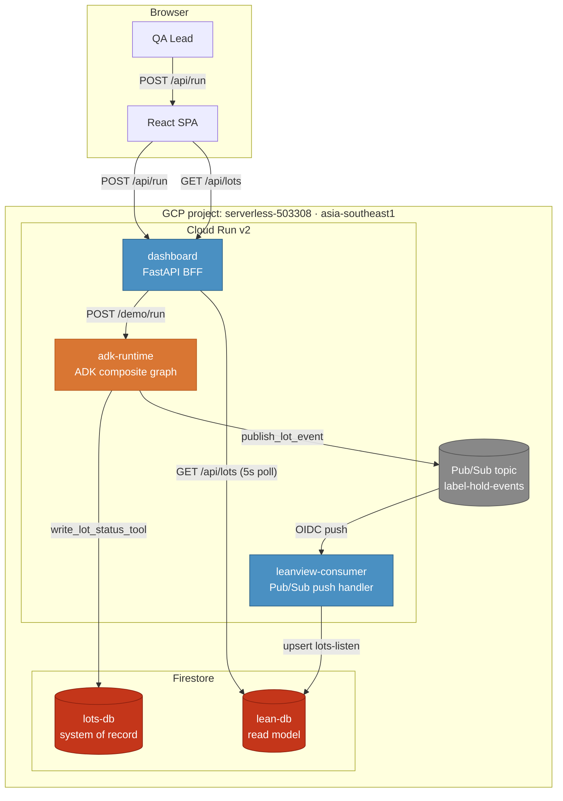

Four Cloud Run services, two Firestore databases, one Pub/Sub topic. The QA
lead only ever talks to the React SPA; the SPA talks to the dashboard BFF;
the BFF proxies uploads to adk-runtime. Everything else is internal to GCP.

### ADK composite graph

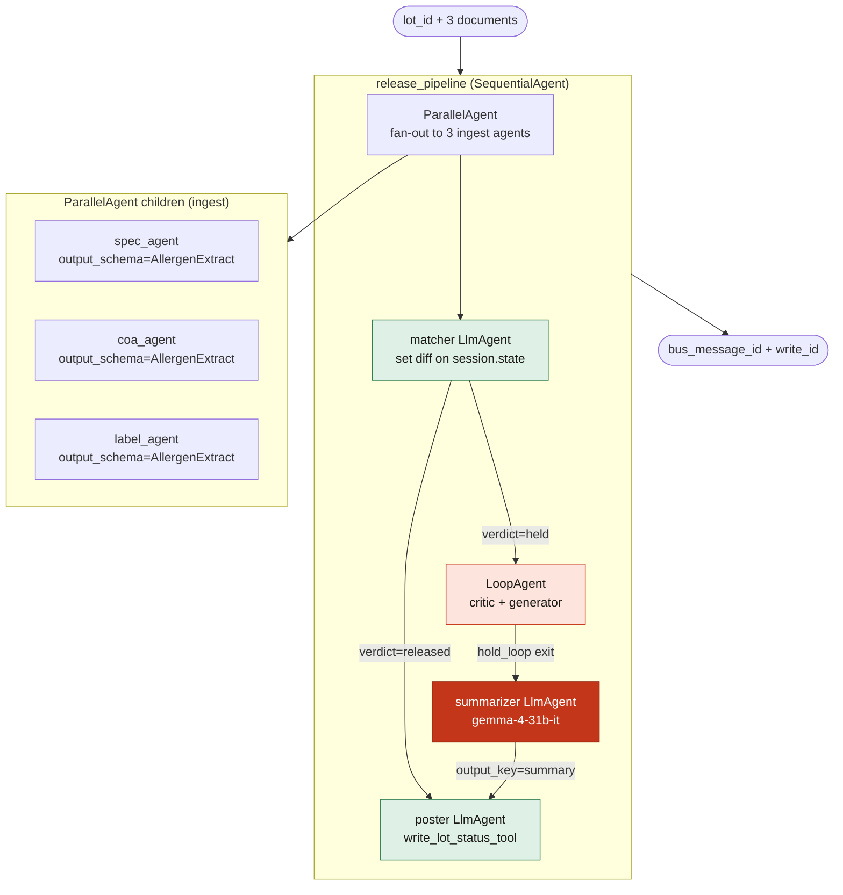

The graph is a `SequentialAgent` with four children: a `ParallelAgent` that
fans out to three ingest agents, a matcher `LlmAgent` that reads the three
extracts from `session.state`, a `LoopAgent` that runs the critic+generator
pair until the matcher exits with a confident HOLD or RELEASE, an optional
`summarizer` that runs only on HELD, and finally a `poster` that writes
Firestore and publishes the bus event.

Total nodes for the HELD path: 12 (3 ingest + 1 matcher + 2 hold_loop + 1
critic_exit + 1 summarizer + 1 poster + final-state). The RELEASED path is
11 (summarizer skipped).

### Lot data flow

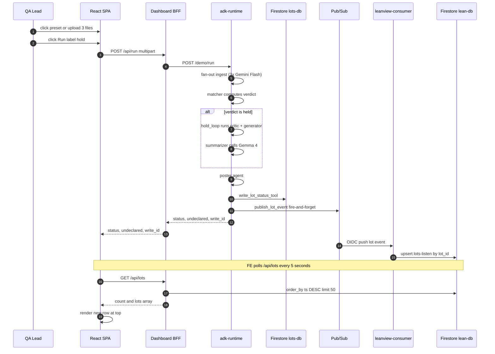

The fire-and-forget on step 13 means a Pub/Sub outage does not fail the lot
release — the primary write to `lots-db` already succeeded by then. The
consumer catches up when Pub/Sub recovers. The `bus_message_id` is stamped
onto the primary row so the consumer can dedupe redeliveries.

### Multi-allergen set difference

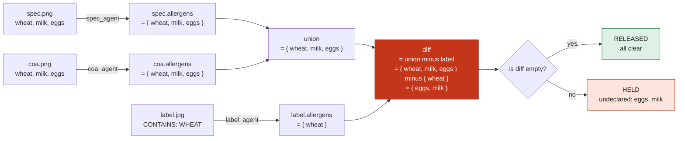

The set difference is computed deterministically in `label_hold/allergens.py`.
The LLM explains it; the math decides.

---

## Example input images

Five ready-to-use fixture scenarios ship in `fixtures/`. Each is a complete
three-document set (spec + CoA + label) that exercises a different pipeline
path. Click any preset in the UI to drive one end-to-end, or download the
three images and upload them manually. Thumbnails below are pre-cropped
(auto-detect background, 8px padding) and re-encoded as WebP from
`fixtures/thumbs/`.

### Scenario 1: Held — fish missing on the label

Spec and CoA declare fish (yellowfin tuna), soy, sesame, wheat. The printed
label only declares soy, sesame, wheat. Fish is the first ingredient but is
missing from the `CONTAINS` line — held with `[fish]`. Tests synonym
extraction ("yellowfin tuna" → `fish`) and allergen canonicalization.

<table>
  <tr>
    <td align="center">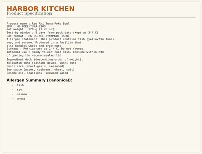<br/><sub>spec</sub></td>
    <td align="center">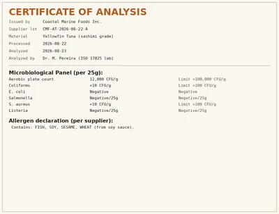<br/><sub>CoA</sub></td>
    <td align="center">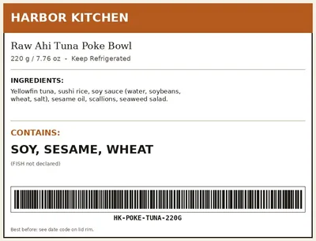<br/><sub>label</sub></td>
  </tr>
</table>

| Document | Verdict |
|---|---|
| spec — Raw Ahi Tuna Poke Bowl | declares fish, soy, sesame, wheat |
| CoA — Coastal Marine Foods | declares FISH, SOY, SESAME, WHEAT |
| label — printed lid | declares SOY, SESAME, WHEAT only |
| **Pipeline result** | **held · undeclared: [fish]** |

### Scenario 2: Released — full multi-allergen declaration

Spec and CoA declare wheat, milk, eggs. Label declares WHEAT, MILK, EGGS
(the full set). Diff is empty. Released. Tests the FDA `Contains:` rule and
the clean-release path (Gemma is skipped by design to keep this path fast).

<table>
  <tr>
    <td align="center">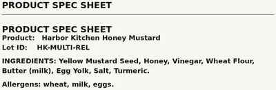<br/><sub>spec</sub></td>
    <td align="center">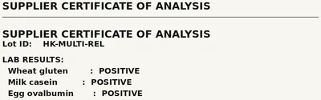<br/><sub>CoA</sub></td>
    <td align="center">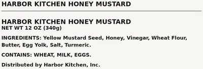<br/><sub>label</sub></td>
  </tr>
</table>

| Document | Verdict |
|---|---|
| spec — multi-allergen | declares wheat, milk, eggs |
| CoA — supplier cert | declares wheat, milk, eggs |
| label — front-of-pack | declares WHEAT, MILK, EGGS |
| **Pipeline result** | **released · all clear** |

### Scenario 3: Held — partial declaration (FDA rule)

Spec and CoA declare wheat, milk, eggs. Label declares WHEAT only. Two
allergens are missing from the label. Held with `[eggs, milk]`. Tests the
case where the label declares *some* allergens but not all — the FDA rule
applies regardless.

<table>
  <tr>
    <td align="center">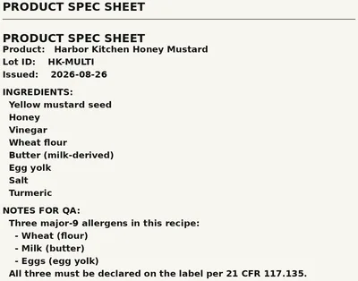<br/><sub>spec</sub></td>
    <td align="center">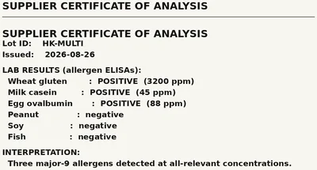<br/><sub>CoA</sub></td>
    <td align="center">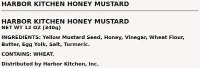<br/><sub>label</sub></td>
  </tr>
</table>

| Document | Verdict |
|---|---|
| spec — multi-allergen | declares wheat, milk, eggs |
| CoA — supplier cert | declares wheat, milk, eggs |
| label — front-of-pack | declares WHEAT only |
| **Pipeline result** | **held · undeclared: [eggs, milk]** |

### Scenario 4: Held — missing allergen panel

Spec and CoA declare wheat, milk, eggs. Label has the ingredient deck but the
allergen panel is intentionally blank. The matcher treats a missing panel as
"all three declared allergens are undeclared." Held with `[wheat, milk, eggs]`.
Tests the difference between *missing declaration* and *incomplete document*.

<table>
  <tr>
    <td align="center">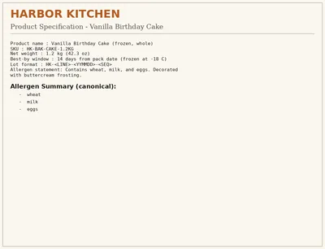<br/><sub>spec</sub></td>
    <td align="center">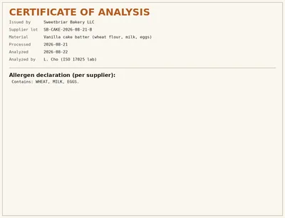<br/><sub>CoA</sub></td>
    <td align="center">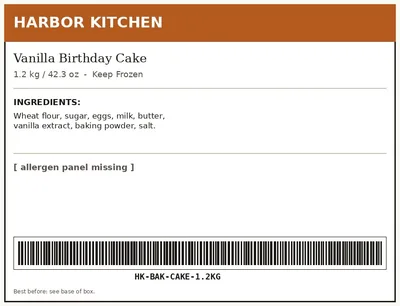<br/><sub>label</sub></td>
  </tr>
</table>

| Document | Verdict |
|---|---|
| spec — vanilla cake | declares wheat, milk, eggs |
| CoA — supplier cert | declares wheat, milk, eggs |
| label — box label | no allergen panel present |
| **Pipeline result** | **held · undeclared: [wheat, milk, eggs]** |

### Scenario 5: Released — tree nuts fully declared

Spec and CoA declare tree nuts (almonds, cashews, hazelnuts) and wheat.
Label declares TREE NUTS (ALMONDS, CASHEWS, HAZELNUTS), WHEAT. Diff is empty.
Released. Tests multi-nut canonicalization (almonds → `tree_nuts`).

<table>
  <tr>
    <td align="center">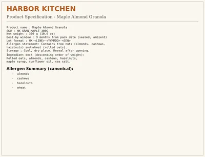<br/><sub>spec</sub></td>
    <td align="center">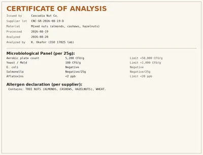<br/><sub>CoA</sub></td>
    <td align="center">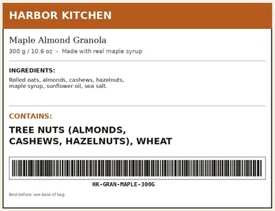<br/><sub>label</sub></td>
  </tr>
</table>

| Document | Verdict |
|---|---|
| spec — maple almond granola | declares tree nuts, wheat |
| CoA — supplier cert | declares tree nuts, wheat |
| label — printed bag | declares tree nuts (3), wheat |
| **Pipeline result** | **released · all clear** |

### Regenerate the fixtures

```bash
# Regenerate the input images (PNG/JPEG in fixtures/<scenario>/)
python3 scripts/generate_fixtures.py

# Re-build the README thumbnails (auto-crop + WebP, written to fixtures/thumbs/)
python3 scripts/make_thumbs.py
```

The generator uses Pillow + DejaVu fonts and lives in
`scripts/generate_fixtures.py`. Add a new scenario by writing a 60-line
`render_*` function and appending it to `main()`.

---

## Live demo

Open **https://frontend-472857763269.asia-southeast1.run.app/** in any browser.

Five preset buttons ship pre-built three-document sets for the most
interesting pipeline paths. Click any preset, the lot ID auto-fills, the
three drop zones populate from the frontend's bundled fixtures, and Run is
enabled. Within ~10-15 seconds the row appears at the top of "Recent
verdicts".

You can also drag-and-drop your own three files (PNG/JPEG/PDF, any combo)
into the drop zones.

---

## Running locally

The repo ships a smoke harness and a fixture generator. Everything below runs
locally; you don't need any GCP credentials to exercise the test scenarios.

```bash
# Clone
git clone https://github.com/AndreMashukov/label-hold.git
cd label-hold

# Set up Python venv (sandbox /tmp is noexec; use /opt/data)
uv venv .venv
source .venv/bin/activate
uv pip install -r apps/adk-runtime/requirements.txt
uv pip install -r apps/dashboard/pyproject.toml
uv pip install -r apps/leanview-consumer/requirements.txt

# Run the local smoke harness against the deployed services
DASHBOARD_URL=https://dashboard-hnvjxkvfoq-as.a.run.app bash scripts/smoke_all.sh

# Regenerate the test fixtures (Pillow + DejaVu fonts)
python3 scripts/generate_fixtures.py
```

To run the React frontend against the local dashboard BFF (port 8080):

```bash
cd apps/frontend
npm install
VITE_API_BASE=http://localhost:8080 npm run dev
```

---

## Cloud Run deployment

Each app has its own Dockerfile. Build context is the repo root so the
`COPY apps/<app>/...` paths in each Dockerfile resolve.

```bash
PROJECT_ID=serverless-503308 \
REGION=asia-southeast1 \
REPO=label-hold-apps-dev \
  bash scripts/deploy_all.sh
```

`deploy_all.sh` rebuilds adk-runtime → leanview-consumer → dashboard →
frontend in order, each via Cloud Build. Each step is idempotent:
re-running on an unchanged tree just re-pins the same digest. Set
`SKIP_PIN=1` to build only without pinning a new revision.

To add a new service to the pipeline: extend the allowlist in
`scripts/deploy-image.sh`, add a `Dockerfile` under `apps/<app>/`, and write
a `cloudbuild.yaml`-compatible step. The pipeline reads
`terraform/scripts/cloudbuild.yaml` which already does the right
`docker build` per `_APP_NAME` substitution.

---

## Repository layout

```text
label-hold/
├── apps/
│   ├── adk-runtime/           # ADK composite graph (Python, FastAPI)
│   ├── leanview-consumer/     # Pub/Sub push consumer + Firestore materializer
│   ├── dashboard/             # FastAPI BFF + SPA shell + proof-of-action harness
│   └── frontend/              # React + TypeScript + Vite SPA
├── fixtures/                  # Test scenarios (PNG/JPEG)
│   ├── hk-raw-tuna/           # held [fish]
│   ├── hk-tree-nuts-mix/      # released
│   ├── hk-empty-label/        # held [wheat, milk, eggs]
│   ├── hk-multi-allergen/     # held [eggs, milk]
│   └── hk-multi-allergen-released/  # released
├── label_hold/                # ADK graph code (release_pipeline)
├── scripts/                   # deploy / smoke / demo / fixture gen
├── terraform/                 # infra modules (event-hub, identity, bff-service)
├── tests/                     # end-to-end smoke + bus publish tests
├── AGENTS.md                  # operational log (build state, gotchas)
├── README.md                  # this file
└── .gcloudignore              # keep Cloud Build tarball small
```

---

## Allergen vocabulary

The model is asked to extract allergens into the US major-9 set: **milk,
eggs, fish, shellfish, tree nuts, peanuts, wheat, soy, sesame**.

`label_hold/allergens.py` provides a defensive second-pass normalizer that
maps common synonyms to canonical form before the set difference:

| Canonical | Common synonyms the normalizer catches |
|---|---|
| milk | dairy, casein, butter, whey, lactalbumin, butterfat |
| fish | tuna, salmon, cod, anchovy, bass, halibut |
| shellfish | shrimp, crab, lobster, prawn, crayfish |
| tree nuts | almonds, cashews, hazelnuts, walnuts, pecans |
| peanuts | groundnuts, arachis |
| wheat | flour, gluten, semolina, durum |
| soy | soybean, soya, edamame, tofu |
| sesame | tahini |

Gemini Flash's structured output also canonicalizes on its own — the Python
normalizer is the second line of defense for stragglers.

---

## Design decisions

- **Composite graph at the root, single matcher downstream.** A
  `SequentialAgent` that contains a `ParallelAgent` keeps the topology
  explicit and lets the matcher read three structured extracts from
  `session.state` rather than getting them jammed into one prompt.
- **Deterministic set difference decides; model explains.** The matcher's
  LLM produces a textual reasoning, but the verdict is computed in
  `label_hold/allergens.undeclared()`. Same precedence as a rule service:
  model can explain, never override.
- **Two Firestores: `lots-db` is the system of record, `lean-db` is the
  read model.** Only `adk-runtime` writes `lots-db`. Only
  `leanview-consumer` writes `lean-db`. The dashboard reads `lean-db` via
  `lots-listen/` with `order_by(ts DESC)`. This is the CPCQ
  publish-consume pattern.
- **Pub/Sub is fire-and-forget from the poster.** `publish_lot_event()`
  swallows errors and stamps `bus_message_id` onto the Firestore row. A
  Pub/Sub outage cannot fail a lot release.
- **Gemma only fires on HELD.** Released lots skip the second-model call
  entirely to keep the clean path fast and avoid burning Gemma quota.
- **Idempotent on `lot_id`.** Replaying a lot on the same `lot_id` produces
  exactly one row in `lots/` and one row in `lots-listen/` with the same
  `write_id`.

---

## Operational notes

- **Build context.** Cloud Build tarball is gated by `.gcloudignore` at
  repo root. Without it, each build ships ~500 MiB of `.venv` +
  `node_modules` + fixtures. With it, ~370 KiB / 13 files.
- **Per-app Dockerfiles only `COPY` their own subtree.** The build sends
  the whole repo but each image only carries what it needs. Tradeoff vs.
  aggressive exclusion that risks accidentally omitting the app under
  construction.
- **Token bootstrap for `gcloud` SDK calls.** Inside the build container,
  `gcloud` CLI calls need `CLOUDSDK_AUTH_ACCESS_TOKEN` populated; ADC alone
  is not enough. `scripts/gcloud-wrap.sh` handles this. Always use command
  substitution, never inline-prefix with the long token — the redaction
  filter corrupts the latter.
- **Cloud Run IAM propagation is slow.** Pub/Sub pushes fail for 60-120s
  after a new binding is applied. Wait, then retry.
- **Firestore `order_by(ts DESC)` requires the field to exist on every
  row.** Stale rows pre-dating the field break the query. Only use it when
  you control all writers (the leanview-consumer).

See `AGENTS.md` for the full day-by-day build log and accumulated gotchas.

---

Built for the All Things Agentic Hackathon (Google, Devpost, Taskmaster
track). 2026-08-31 deadline.
